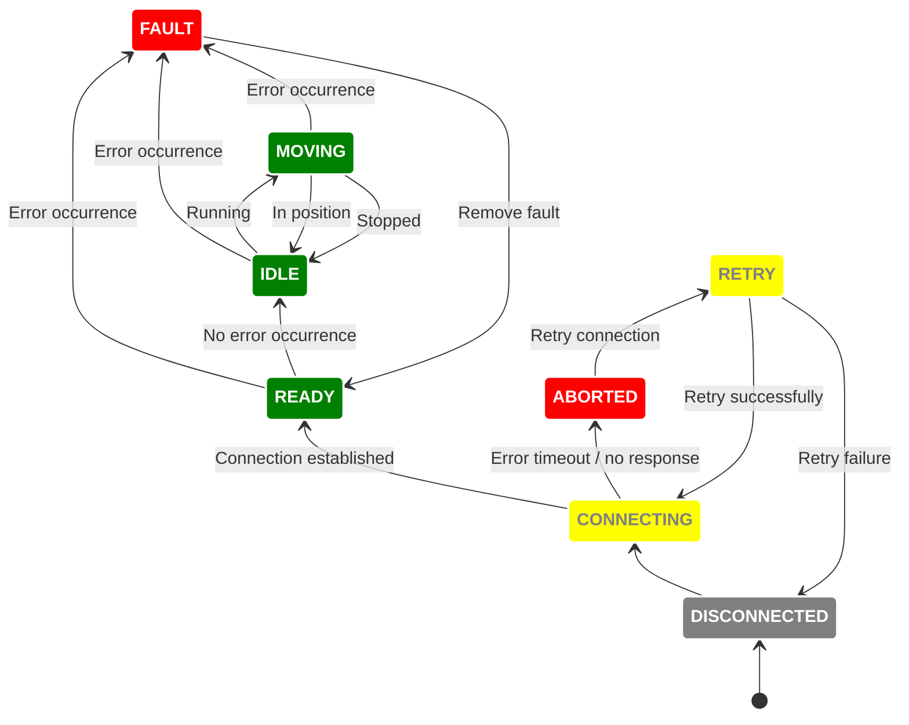

# sdk_waveshare

State Machine

```mermaid
stateDiagram-v2
    direction BT
    
    accTitle: This is accesible title
    accDescr: This is description
    
    classDef notMoving fill:white
    classDef movement font-style:italic
    classDef stateStable fill:green,color:white,font-weight:bold,stroke-width:2px,stroke:white
    classDef stateFailure fill:red,color:white,font-weight:bold,stroke-width:2px,stroke:white
    classDef stateTransitional fill:yellow,color:grey,font-weight:bold,stroke-width:2px,stroke:white
    classDef stateDisconnected fill: grey, color:white, font-weight:bold, stroke-width:2px,stroke:white
    
    class DISCONNECTED stateDisconnected
    class CONNECTING, RETRY stateTransitional
    class READY, MOVING, IDLE stateStable
    class ABORTED, FAULT stateFailure
    
    
    [*] --> DISCONNECTED
    DISCONNECTED --> CONNECTING
    CONNECTING --> READY: Connection established
    CONNECTING --> ABORTED: Error timeout / no response
    
    ABORTED --> RETRY: Retry connection
    RETRY --> CONNECTING: Retry successfully
    RETRY --> DISCONNECTED: Retry failure
    
    READY --> FAULT: Error occurrence
    MOVING --> FAULT: Error occurrence
    IDLE --> FAULT: Error occurrence
    
    READY --> IDLE: No error occurrence
    
    IDLE --> MOVING: Running
    
    MOVING --> IDLE: In position
    MOVING --> IDLE: Stopped
    
    FAULT --> READY: Remove fault
    
```

/transport

```mermaid
classDiagram
    direction TD
    class DeviceID {
        <<enumeration>>
        BROADCAST = 254
        MAX_ID = 252
    }
    class ByteOrder {
        <<enumeration>>
        LITTLE_ENDIAN = 0
        BIG_ENDIAN = 1
    }
    class Instruction {
        <<enumeration>>
        PING = 1
        READ = 2
        WRITE = 3
        REG_WRITE = 4
        ACTION = 5
    }
    class CommResultCodes {
        <<enumeration>>
        SUCCESS = 0
        PORT_BUSY = -1
        TX_FAIL = -2
        RX_FAIL = -3
        TX_ERROR = -4
        RX_WAITING = -5
        RX_TIMEOUT = -6
        RX_CORRUPT = -7
        NOT_AVAILABLE = -9
    }
    class BaudRate {
        <<enumeration>>
        BAUD_9600 = 9600
        BAUD_115200 = 115200
        BAUD_57600 = 57600
        BAUD_250000 = 250000
        BAUD_500000 = 500000
        BAUD_1000000 = 1000000
        BAUD_2000000 = 2000000
    }
    class BaudRateInSt {
        <<enumeration>>
        ST_1M = 0
        ST_0_5M = 1
        ST_250K = 2
        ST_128K = 3
        ST_115200 = 4
        ST_76800 = 5
        ST_57600 = 6
        ST_38400 = 7
    }
    class EPROMReadOnly {
        <<enumeration>>
        LOWER_BYTE = 3
        HIGHER_BYTE = 4
    }
    class EPROMReadWrite {
        <<enumeration>>
        DEVICE_ID = 5
        BAUD_RATE = 6
        MIN_ANGLE_LIMIT_L = 9
        MIN_ANGLE_LIMIT_H = 10
        MAX_ANGLE_LIMIT_L = 11
        MAX_ANGLE_LIMIT_H = 12
        CW_DEAD_ZONE = 26
        CCW_DEAD_ZONE = 27
        OFFSET_L = 31
        OFFSET_H = 32
        OPERATING_MODE = 33
        
    }
    class SRAMReadWrite {
        <<enumeration>>
        TORQUE_ENABLE = 40
        ACCELERATION = 41
        GOAL_POSITION_L = 42
        GOAL_POSITION_H = 43
        GOAL_TIME_L = 44
        GOAL_TIME_H = 45
        GOAL_SPEED_L = 46
        GOAL_SPEED_H = 47
        LOCK_EEPROM = 55
    }
    class SRAMReadOnly {
        <<enumeration>>
        POSITION_L = 56
        POSITION_H = 57
        SPEED_L = 58
        SPEED_H = 59
        LOAD_L = 60
        LOAD_H = 61
        VOLTAGE = 62
        TEMPERATURE = 63
        STATUS = 66
        CURRENT_L = 69
        CURRENT_H = 70
    }
    class DefaultValue {
        <<enumeration>>
        LATENCY_TIMER = 50
    }
    class ServoController {
        + init() -> None
    }
    class ServoDriver {
        + init(servo_id: int, servo_controller: ServoController) -> None
        + status() -> bool
        + is_in_the_position(position: int) -> bool
        + move_to_position(position: int) -> None
        + read_current_position() -> int
    }
```
    

